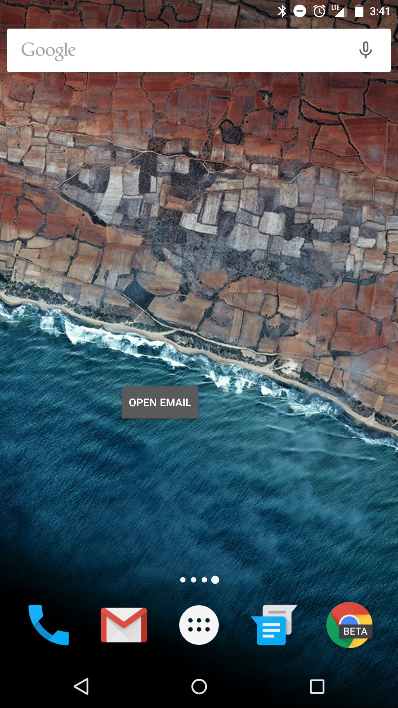

# EmailWidget - Android Sample

This sample application is an example of a simple home screen widget which launches an email application on the device. 

The purpose of this sample is to demonstrate the ability to deploy wrapped widget applications (with no launchable activity) to Secure Workspace.

Additionally, this sample demonstrates how Secure Workspace limits the intent chooser applications to the applications only in the workspace. In the context of this sample, the intent chooser will only allow the user to open the workspace email application.

**Applies To**

* [Installing Android or iOS apps in the work space](https://developer.blackberry.com/devzone/develop/enterprise/install_android_or_ios_work_space_app.html)

**Author(s)** 

* Andrew Frolkin

## Screenshots ##

## How To Build

1. Clone the repo to your computer.
2. [Install Android Studio] (https://developer.android.com/sdk/installing/index.html?pkg=studio) (if not installed)
3. In Android Studio, click on File -> Import Project, and select the project (for example EmailWidget)
4. [Build and run the application] (https://developer.android.com/tools/building/building-studio.html)

## More Info

* [Secure Work Space for Android](http://docs.blackberry.com/en/smartphone_users/subcategories/?userType=1&category=BlackBerry+Apps+for+Android&subCategory=Secure+Work+Space+for+Android) - User guides and release notes for SecureWorkSpace
* [App Widgets](https://developer.android.com/guide/topics/appwidgets/index.html) - Official Android Documentation on App Widgets
* [Email Intents](https://developer.android.com/guide/components/intents-common.html#Email) - Official Android Documentation on creating email intents

## Disclaimer

THE SOFTWARE IS PROVIDED "AS IS", WITHOUT WARRANTY OF ANY KIND, EXPRESS OR IMPLIED, INCLUDING BUT NOT LIMITED TO THE WARRANTIES OF MERCHANTABILITY, FITNESS FOR A PARTICULAR PURPOSE AND NONINFRINGEMENT. IN NO EVENT SHALL THE AUTHORS OR COPYRIGHT HOLDERS BE LIABLE FOR ANY CLAIM, DAMAGES OR OTHER LIABILITY, WHETHER IN AN ACTION OF CONTRACT, TORT OR OTHERWISE, ARISING FROM, OUT OF OR IN CONNECTION WITH THE SOFTWARE OR THE USE OR OTHER DEALINGS IN THE SOFTWARE.
