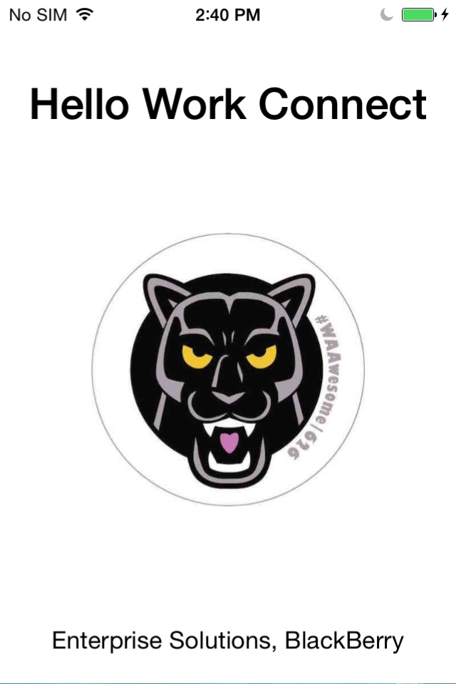

# iOS: Sample Work Connect Launcher for SWS

This sample app shows how to set up a custom URL scheme and launch the Work Connect app on SWS via its registered URL scheme. 

## Requirements

* BlackBerry Enterprise Serivce(BES) with Secure Work Space
* BES Activated iOS device with iOS Developer Enterprise Program

## Applies to

iOS 8 SDK or later

## Runtime

iOS 8 or later

## Author(s)

* [EunKyung Choi](http://www.twitter.com/echotown)

**Contributing**

* To contribute code to this repository you must be [signed up as an official contributor](http://blackberry.github.com/howToContribute.html).

## Screenshots ##

## How To Build and Deploy

1. Clone the repo to your computer.
2. Create 'Explicit App ID' for the app. e.g. com.yourcompany.appname
    Note: Not recommended to create 'Wildcard App ID'
3. Create In-House Distribute Provisioning Profile from iOS Enterprise Developer Account.
4. Build the release in Xcode. 
5. Create a distribution file(IPA) as Enterprise Deployment(In-House).
6. Sign the app with the In-House Distribution Provisioning Profile created for the app.
7. Secure the app via BES
8. Resign the app with the In-House distribution provisioning profile.
    Note: Use [SWS Auto-Resigner Script](https://github.com/ekcworld/Secure-Work-Space/tree/master/Resigning-Scripts/Auto-Resigner-For-iOS).
9. Deploy the resigned app via BES

For more information on how to deploy iOS apps in the work space, please visit [Installing Android or iOS apps in the work space](https://developer.blackberry.com/devzone/develop/enterprise/install_android_or_ios_work_space_app.html) 

## License

Apache License

## Disclaimer

THE SOFTWARE IS PROVIDED "AS IS", WITHOUT WARRANTY OF ANY KIND, EXPRESS OR IMPLIED, INCLUDING BUT NOT LIMITED TO THE WARRANTIES OF MERCHANTABILITY, FITNESS FOR A PARTICULAR PURPOSE AND NONINFRINGEMENT. IN NO EVENT SHALL THE AUTHORS OR COPYRIGHT HOLDERS BE LIABLE FOR ANY CLAIM, DAMAGES OR OTHER LIABILITY, WHETHER IN AN ACTION OF CONTRACT, TORT OR OTHERWISE, ARISING FROM, OUT OF OR IN CONNECTION WITH THE SOFTWARE OR THE USE OR OTHER DEALINGS IN THE SOFTWARE.