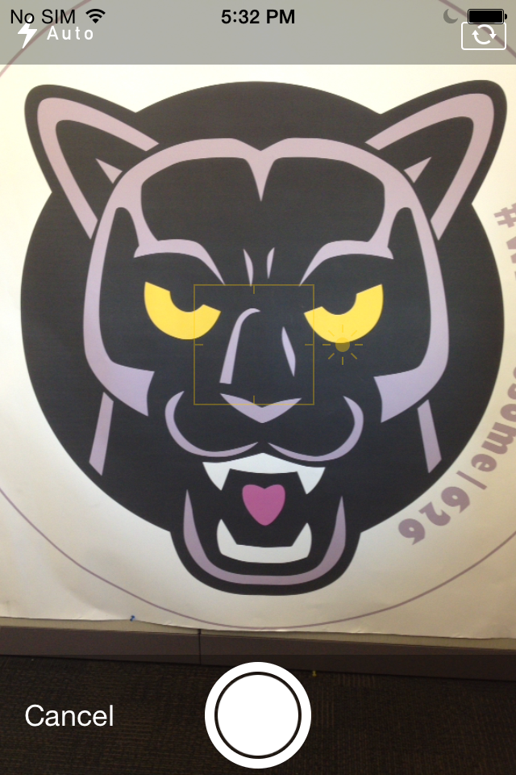

# Secure Camera for SWS - Sample iOS Camera App for SWS

This sample app allows the user to take pictures securely in the secure work space environment and save the image to the application's documents folder. The images can be shared securely via Work Connect app.

The features include:

* take a photo (retake/use photo)
* browse/select saved images in the application's documents folder
* share/send a selected image as an email attachemet via Work Connect

## Requirements

* BlackBerry Enterprise Serivce(BES) with Secure Work Space
* BES Activated iOS device with iOS Developer Program or iOS Developer Enterprise Program

## Applies to

iOS 8 SDK or later

## Runtime

iOS 8 or later

## Author(s)

* [EunKyung Choi](http://www.twitter.com/echotown)

**Contributing**

* To contribute code to this repository you must be [signed up as an official contributor](http://blackberry.github.com/howToContribute.html).

## Screenshots ##

## How To Build and Deploy

1. Clone the repo to your computer.
2. Create Explicit App ID for the app.
    Note: Not recommended to create Wildcard App ID
3. Create In-House Distribute Provisioning Profile from iOS Developer Enterprise Account.
4. Create an archive of the app(IPA), distribute the archive as Enterprise Deployment signing with the In-House distribution provisioning profile.
5. Secure the app via BES
6. Resign the app with the In-House distribution provisioning profile.
    Note: Use [SWS Auto-Resigner Script](https://github.com/ekcworld/Secure-Work-Space/tree/master/Resigning-Scripts/Auto-Resigner-For-iOS).
7. Deploy the resigned app via BES

For more information on how to deploy iOS apps in the work space, please visit [Installing Android or iOS apps in the work space](https://developer.blackberry.com/devzone/develop/enterprise/install_android_or_ios_work_space_app.html) 

## License

Apache License

## Disclaimer

THE SOFTWARE IS PROVIDED "AS IS", WITHOUT WARRANTY OF ANY KIND, EXPRESS OR IMPLIED, INCLUDING BUT NOT LIMITED TO THE WARRANTIES OF MERCHANTABILITY, FITNESS FOR A PARTICULAR PURPOSE AND NONINFRINGEMENT. IN NO EVENT SHALL THE AUTHORS OR COPYRIGHT HOLDERS BE LIABLE FOR ANY CLAIM, DAMAGES OR OTHER LIABILITY, WHETHER IN AN ACTION OF CONTRACT, TORT OR OTHERWISE, ARISING FROM, OUT OF OR IN CONNECTION WITH THE SOFTWARE OR THE USE OR OTHER DEALINGS IN THE SOFTWARE.